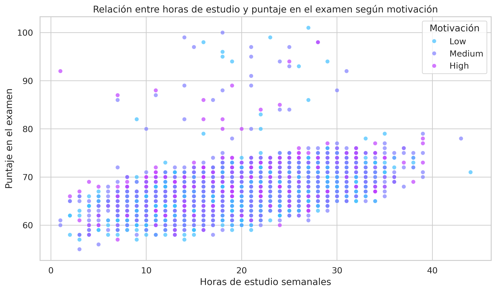
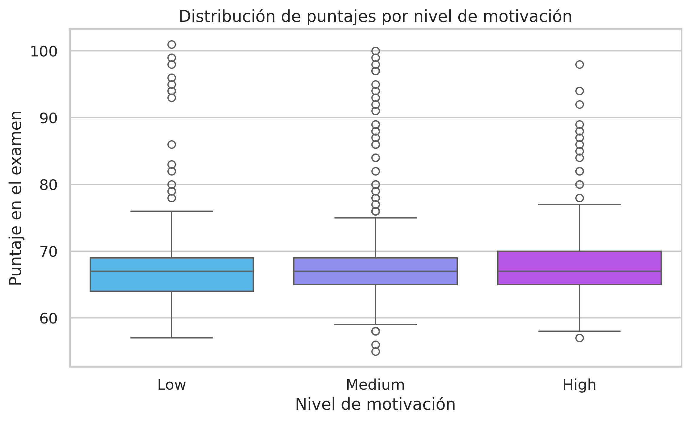
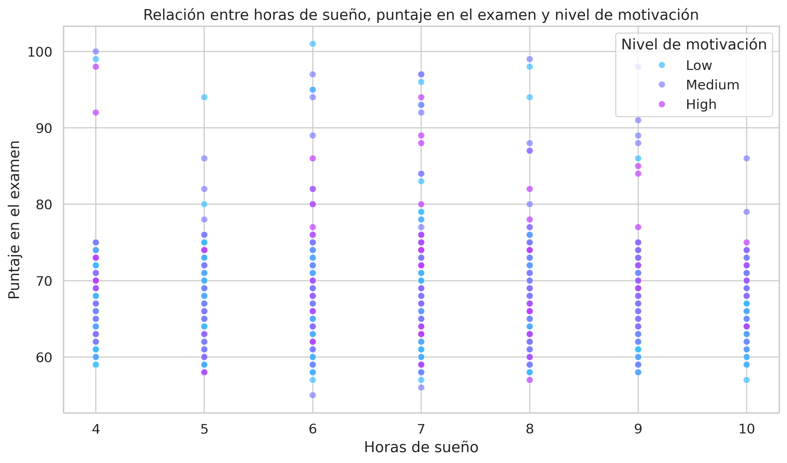
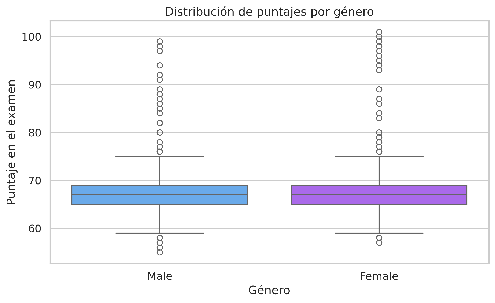
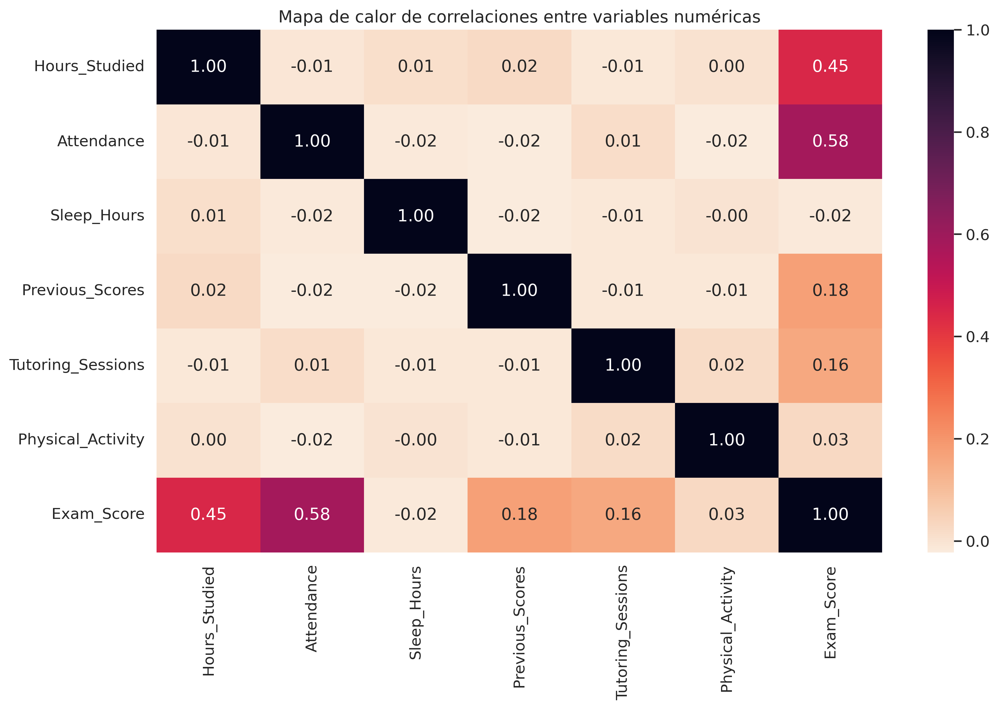
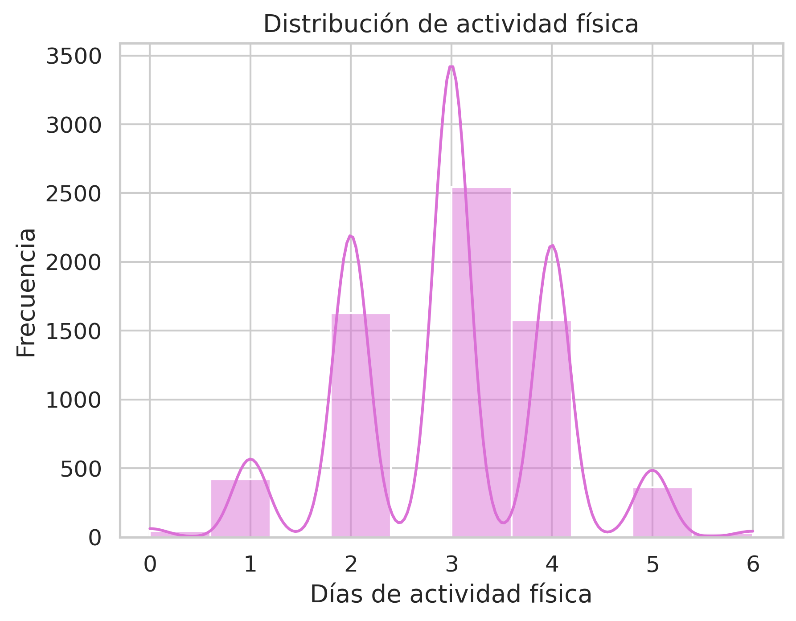

# Student Performance Analysis

## Exploring the factors that influence student academic performance

This project analyzes how personal, academic, and family-related factors affect students’ final exam performance.  
Using the **Student Performance Factors** dataset from Kaggle, the analysis explores patterns, tests hypotheses, and identifies which variables most strongly predict the final exam score (**Exam_Score**).

The goal is to provide insights that help educators, institutions, and anyone interested in understanding what supports or limits student academic success.

---

## Dataset

- **Source:** Kaggle – Student Performance Factors  
- Included in the repository under `/data` for full reproducibility.  
- Variables include:  
  - Study habits  
  - Attendance  
  - Family background  
  - Sleep and physical activity  
  - Motivation  
  - Previous academic performance  
  - Demographic information  

---

## Objectives

- Analyze the impact of study habits (study hours, attendance).  
- Examine family variables such as parental education and income.  
- Explore personal factors: sleep, physical activity, motivation, gender, learning difficulties.  
- Test hypotheses about which variables best predict academic performance.  
- Produce clear visualizations to support insights.

---

## Tech Stack

- Python  
- Pandas, NumPy  
- Matplotlib, Seaborn  
- Google Colab  

---

## Repository Structure
```
/data  
    StudentPerformanceFactors.csv  

/notebook  
    Student_Performance_Factors.ipynb  

requirements.txt  
```
---

## Key Findings

- **Attendance** is the strongest predictor of exam score (correlation 0.58).  
- **Study hours** also show a meaningful positive effect.  
- **Previous scores** strongly correlate with current exam performance.  
- **Parental education level** shows a clear upward trend: higher education → higher exam scores.  
- **Motivation** shows small differences but is not a strong predictor on its own.  
- **Internet access**, **gender**, and **school type** (public/private) have no significant impact.  
- **Sleep** and **physical activity** show weak or negligible relationships with performance.

Overall: academic performance is mainly driven by **study habits and school participation**, while demographic factors have much less influence.

---

## Results / Figures

### Hours Studied vs Exam Score


### Exam Score by Motivation


### Sleep Hours vs Exam Score


### Exam Score by Gender


### Attendance, Previous Scores vs Exam


### Exam Score by Parental Education (Avg)


### Exam Score by Parental Education (Boxplot)


### Correlation Heatmap


### School Type Distribution


### Exam Score by School Type (KDE)


### Physical Activity Histogram


### Physical Activity vs Exam Score


## How to Reproduce

1. Clone or download the repository.  
2. Install the required dependencies:
```
pip install -r requirements.txt
```
3. Open and run the notebook:
```
/notebook/Student_Performance_Analysis.ipynb
```
